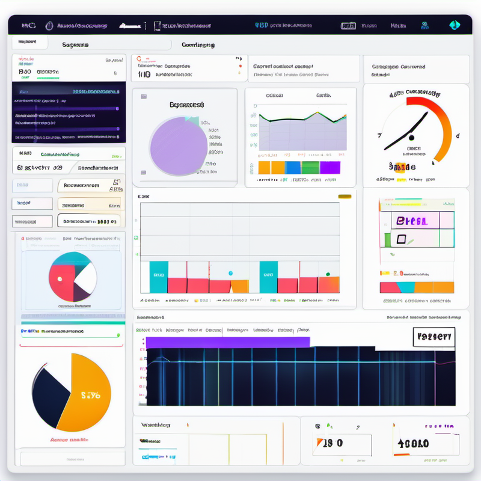
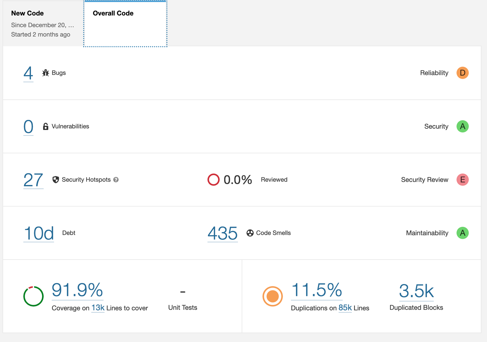
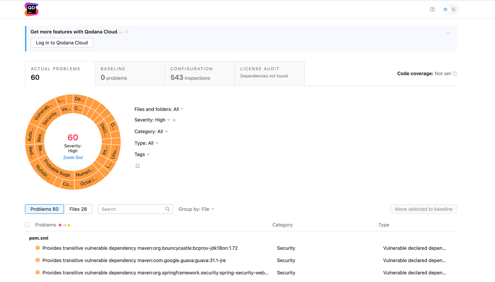
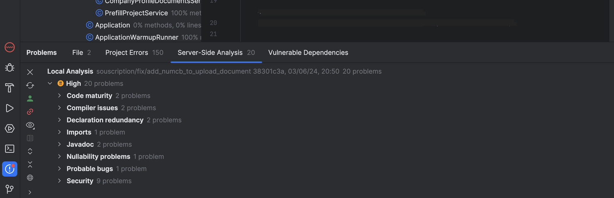
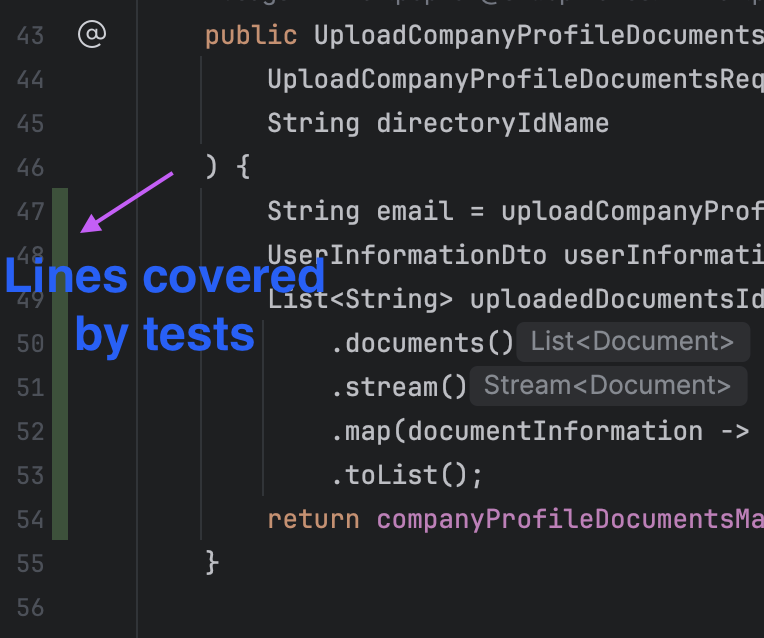
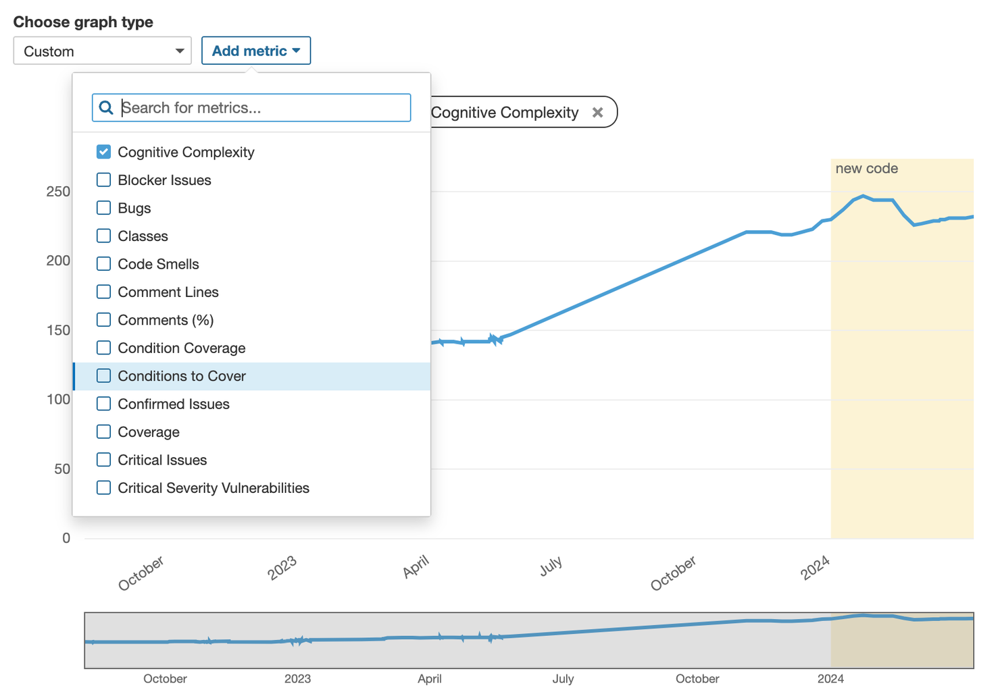
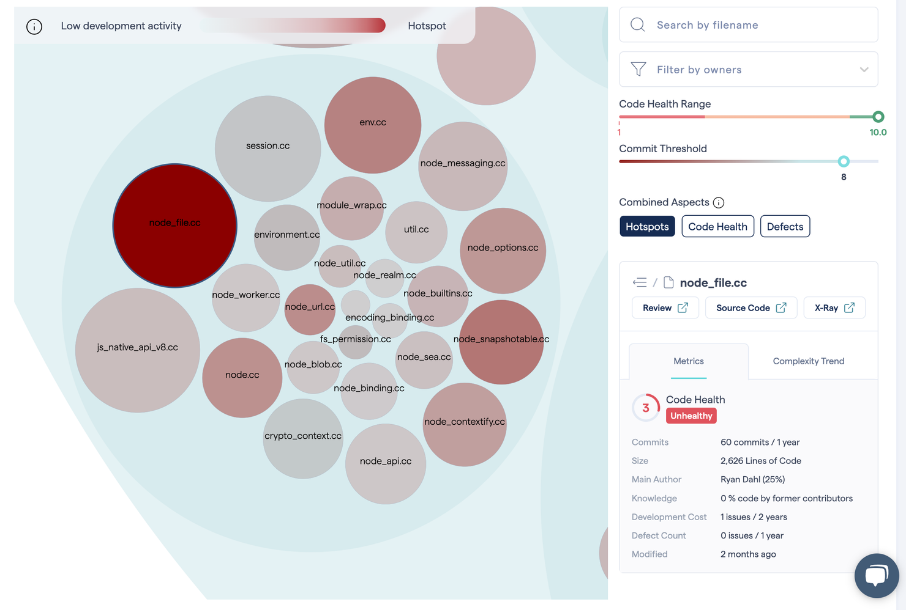
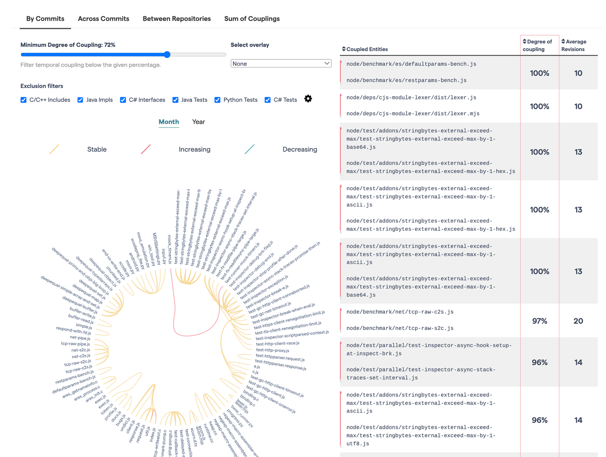

# Code Quality Tools: Finding the Perfect Fit for Your Project

# Introduction

Static code analysis is a set of techniques of analyzing the code against a set of rules without running it.

Why analyze your code ?

- to catch bugs before they occur
- to keep the code maintainable and clean (easy to read & change)
- to keep track of code coverage
- to detects security risks

As a result, development is easier and costs less.

This article explores various code quality analyzers and recommends the best tools for different project contexts, from rapidly growing new projects to large, established codebases with numerous collaborators.

We consider several tools - static code analysers [Sonar](https://www.sonarsource.com/) and [Qodana](https://www.jetbrains.com/qodana/), and [CodeScene](https://codescene.com/) - a behavioral analyser that takes into account the project's git commit history.

# TL;DR

- Sonar Community supports most of the languages, but Qodana Community allows a more seamless IDE integration. If Qodana supports your technology, and you use JetBrains IDEs, why not give it a go.
- As for the paid versions, Qodana is more useful for an actively developing project with less smelly code. Its pricing model allows increasing the codebase quickly without thinking of the increased costs. Easily integrated with IDE, it helps to produce quality from the start of development.
- Sonar is for more mature projects. It provides a larger set of metrics to have more profound understanding of the code quality.
- CodeScene adds another dimension to the analysis and complements static code analyzers. It helps to understand how to efficiently allocate resources during refactorings and make the development cost less.

# What’s in the toolbox

## Static analysis

|  | Sonar | Qodana |
| --- | --- | --- |
| CI/CD integration | + | + |
| Bug detection | + | + |
| CVEs | + | + |
| Coverage | + | Only percentage in dashboard; color indication directly inside the IDE |
| IDE integration | Linter plugin | Real time report |
| Technical debt | Time estimation | - |
| Code duplications | + | - |
| Time graph | + | - |

Static analysis tools Qodana and Sonar propose similar features, such as bad practice and potential bugs detection, [Common Vulnerabilities and Exposures](https://cve.mitre.org/) (CVE) search, CI/CD integration.

Sonar’s main dashboard

Qodana’s main dashboard

Both services may be integrated into IDEs. Sonar proposes a SonarLint plugin that helps to catch code smells even before pushing to the repo and running the CI/CD, only to find that the code quality does not pass the quality gates. Qodana goes further and allows displaying an analysis report directly in a JetBrains IDE in the Problems section, given a Qodana linking plugin is installed. Besides, Qodana dashboard can open the problematic code directly in a corresponding IDE. All you need to do is click the redirection button in a code smell description in your report.

Qodana IDE integration allows browsing analysis report directly in JetBrains IDEs

Sonar and Qodana may display code coverage reports generated during the tests. The difference is where you can view the detailed coverage report. In Sonar, the report is shown in the cloud dashboard, with the overall percentage and coverage information for each file in the project. Qodana visualizes the report directly in a JetBrains IDE once the IDE is linked via the plugin. It might seem a bit sophisticated, but it makes increasing the coverage more inciting and simple.

When the IDE is linked with QodanaCloud, the code coverage report is pulled and displayed directly in the IDE.

Sonar has some additional code quality metrics, such as technical debt estimation (time required to fix all code smells), code duplication percent, a graph of evolution of every possible metric in time. It helps to comprehend more easily the overall quality of the code.

Metrics graph in Sonar allows following evolution of metrics of choice

## Behavioral analysis

Sonar and Qodana are static analysis tools, which means they analyze a snapshot of code. Such analysis gives a basic understanding of the code's condition, but it does not help to understand the potential gain of fixing it. In some cases, the code may be with a lot of problems, but as no one touches it, and it does not contain bugs, it might be wiser not to start a huge refactoring, and move focus to a less problematic part of code that may cause more problems in the future.

To understand code evolution, it is useful to look at its git commit history. That is exactly what CodeScene does - it helps to understand how to better allocate development resources to deal with the technical debt in the most efficient way.

Hotspot analysis in CodeSene. Complex and frequently modified files are bloody-red

Class coupling in CodeScene. Shows not only current state, but also coupling dynamics - stable or increasing/decreasing

CodeScene’s toolbox is thus different from those of Qodana and Sonar. It proposes several kinds of behavioral analysis, such as hotspot detection (smelly code that is changed frequently), components coupling analysis, several team efficiency analysis tools. It helps to associate parts of code with their authors that helps to understand code knowledge of each developer.

# How much it costs

### Sonar

SonarQube has a free Community edition that allows running analysis on-premise for most popular languages ([full list here](https://www.sonarsource.com/products/sonarqube/downloads/)). It allows CI/CD integration and basic vulnerabilities / bugs detection. The linting tool SonarLint is free. 

The paid version allows more advanced faults detection. It is [priced](https://www.sonarsource.com/plans-and-pricing/#sonarqube) by the number of lines of code in the project, stating at €160 per year.

### Qodana

You can run a community version of SonarQube, limited to Java (Java, Kotlin, Groovy), Python and .NET analyzers. The IDE integration is possible for JetBrains IDEs. CI/CD integration is also free.

For other languages and frameworks (JS, for instance), one will have to buy the [ultimate](https://www.jetbrains.com/fr-fr/qodana/buy/?billing=yearly) edition at €5 per month per collaborator.

### CodeScene

CodeScene is free only for open source projects. The pricing model for both on-premise and cloud hosting is per active collaborator per month, [starting](https://codescene.com/pricing) from €18.

# Which one do I need?

If you choose between two community versions, most probably it will depend on what your stack is, as Qodana has less free technologies. If the technology is supported by Qodana, it would be interesting to give a go to its IDE integrations.

The choice between paid versions of Qodana and Sonar may be made based on the project’s maturity. For a small project that will potentially grow in might be interesting to use Qodana as its price will not go up with the increase of the code lines number.

For a more mature project that requires a deeper and a more complex analysis, it is probably better to use one of the Sonar’s solutions.

CodeScene allows going beyond the static analysis, so it does not conflict with tools above. It is the most helpful for projects with a lot of collaborators. In fact, the more collaborators there are in the project, the more useful the result analysis will be.