## Introduction

In 2022 Elsevier, one of the biggest scientific publishing companies, published a report on [Quantum computing research trends](https://www.elsevier.com/solutions/scopus/research-and-development/quantum-computing-report). Conclusion made by the authors - “Quantum technologies are shifting toward enabling real-world uses”. Quantum cryptography, they state, is already seeing some commercial applications.

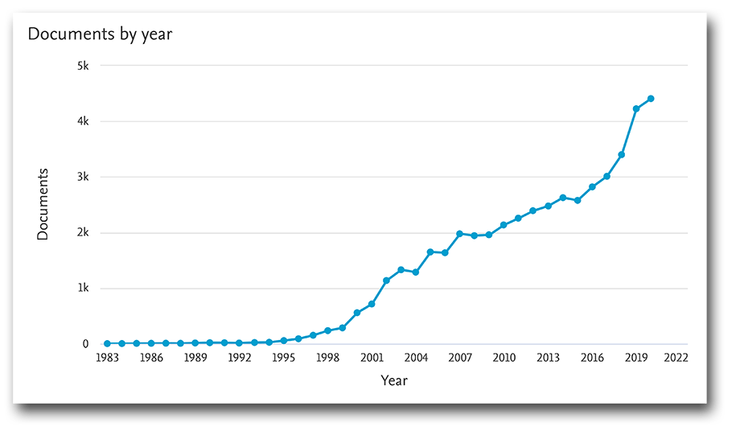

As quantum technologies mature, they will require more and more developers. Quantum algorithms differ from the classical ones. They are based on multiple conceptions that are not common for classical development. This article introduces the basic principles of quantum computing. On an example of a 2×2 Sudoku it explains how they can be used to solve a real-world problem.

### Quantum vs classical

Quantum computers use quantum properties of the matter on an atomic level. It allows solving some specific problems faster than with classical computers. One example of such problem is the [travelling salesman](https://en.wikipedia.org/wiki/Travelling_salesman_problem). It is an NP-hard problem, which is formulated as follows. “Given a list of cities and the distances between each pair of cities, what is the shortest possible route that visits each city exactly once and returns to the origin city?”. The number of possible routes increases drastically as the number of cities N increases: L = (N-1)!/2. This means that the time required to solve this problem on a classical computer increases rapidly. Here quantum computers will be useful, as their power increases exponentially with the number of qubits of the computer. Thanks to the superposition property, quantum computers may verify multiple solutions simultaneously. For instance, a quantum computer with N qubits may test 2^N classical solutions at once. This fact makes it significantly more effective than a classical computer for this particular problem.

### Qubit is the quantum bit

In classical computing, the tiniest portion of information is a **bit** that may be equal to 0 or 1. Quantum computers’ logic is based on quantum bits, **qubits**. Unlike bits, they can be in a condition of a superposition of 0 and 1. This means that before we measure the qubit, it would stay in the **both states** **simultaneously**. This mixed condition is commonly written as a sum of 0 and 1 conditions with coefficients: `|ψ>=α|0>+β|1>`. Here, α and β are complex numbers and are called **quantum** **amplitudes**. The sum of squares of modules of amplitudes is equal to 1: `|α|^2 + |β|^2 = 1`.

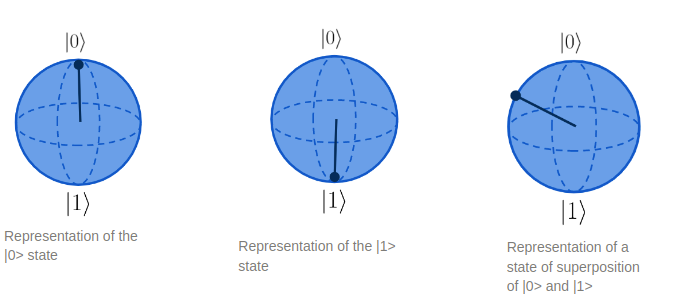

When a function is applied to such a state, it is applied to both states simultaneously: `F(|ψ>)=αF(|0>) + βF(|1>` (as F is linear). In the classical case, computer would have to first calculate the result of application of `F|0>`, then `F|1>`. In the quantum case it is done in one go. A quantum computer with N coherent qubits is able to operate with `2^N` states simultaneously. It increases the calculation speed for some types of problems.

### Measurement

Measurement of a qubit’s state yields the state of the qubit - `|0>` or `|1>`, and the measured value is **probabilistic**. It means that upon measurement both states may be observed, with some probabilities. Probability of each of the two outcomes depend on the corresponding quantum amplitude. For a qubit in the state `|ψ>=α|0>+β|1>`, the probability to measure `|0>` will be `P(|0>) = |α|^2`, and for `|1>` it will be `P(|1>)=|β|^2`. If the qubit is in the ground state `|ψ> = |0>`, the result of its measurement will always be `|0>`, as `α = 1`, and `β = 0`.

Upon the measurement, the superposition state **collapses** to one of the possible outcomes. This means that every measurement of the same qubit after the first one would yield the same result. Quantum bit starts behaving as a simple classical bit. This makes the measurement one of few irreversible operations.

### Oracle-based algorithms

Quantum algorithms may be divided into several families based on problems they solve. Oracle-based algorithms are efficient in “searching for a needle in a haystack” (example: searching for an element in an unsorted array). Oracle-based algorithms are named so because they are built around an **oracle** function. It is a function that takes as argument any possible solution and verifies if this solution is correct for given problem. This article covers the Grover’s algorithm and shows how to make an oracle function for a Sudoku problem.

## Grover’s algorithm

The Grover’s algorithm serves to search for an element in an unsorted array. For example, we have an array with N objects and each object has a “color” property. We seek to find an element with the color equals to “red”. The fastest classical solution is to start from the beginning and check color of each object one by one. The algorithmic complexity of this approach is `O(N)`.

Classical search algorithm checks elements in a list one by one until it finds the good one:

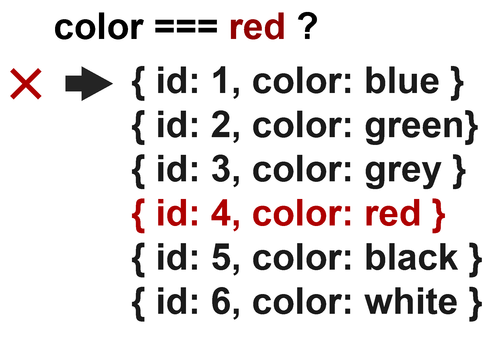

Quantum algorithm is applied to all states simultaneously, with each application increasing chances of measuring the correct answer.

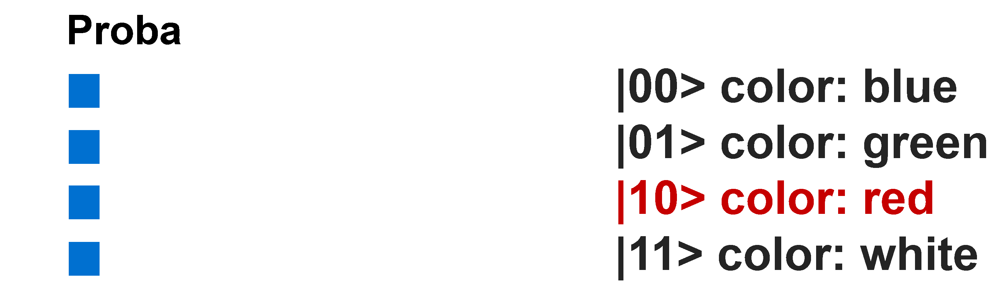

The Grover’s algorithm allows simultaneous verification of multiple elements at once. In order to assure that the answer is correct, it is necessary to repeat this operation `O(√N)` times.

The Grover's algorithm consists of four parts. The state preparation initializes qubit values. The oracle multiplies by -1 the amplitude of the state that corresponds to the correct solution. The amplitude amplification state increases the amplitude of the correct solution. The oracle and amplitude amplification part is repeated `√N` times. Then, the measurement operation measures states of the value qubits to the classical register. With some probability, the measured solution is the correct solution to the problem.

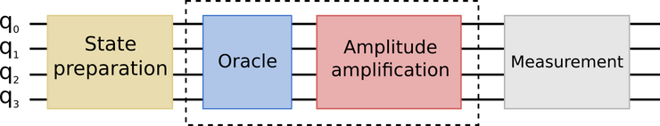

## Sudoku problem

The explanation and implementation of the Grover's algorithm for the Sudoku problem is based on a corresponding page on [QisKit notebook](https://qiskit.org/textbook/ch-algorithms/grover.html)

To showcase solving a real-world problem with a quantum computer algorithm, we will solve a Sudoku with the Grover’s algorithm. The problem is following. We have a square table with numbers in each cell. Some of the numbers we know, others are unknown. We search such a combination that in each row and each column there are no repeating numbers. In this article we consider a 2 by 2 Sudoku. Solving a bigger problem requires either many qubits, or many terabytes of RAM for qubit simulation.

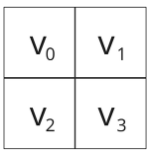

First we will solve a Sudoku with four unknown values. In this case, there are two valid solutions: `v₀=0` , `v₁=1`, `v₂=1`, `v₃=0` and `v₀=1`, `v₁=0`, `v₂=0`, `v₃=1`. To have only one solution, we will have to add a constraint on one of the values. For example, we we fix `v₁=0`. In this case simulation returns only one solution that corresponds to the applied constrained.

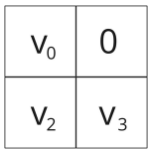

### Making an Oracle

In the Grover’s algorithm, the oracle contains real-world logic and translate it for the quantum computer. In this article we show how to create an oracle based on the Sudoku's rules. The rules state: in each line and column there must be only distinct numbers. In the case of a 2 by 2 Sudoku, there are four clause rules: `v₀≠ v₁`, `v₀≠ v₂`, `v₁≠ v₃`, `v₂≠ v₃`.

Each number may value 0 or 1 and will be represented by a single qubit. To compare qubit values, we need to construct a comparison function. It should return **0** if qubits are in the **same state**, and **1** if their states **differ**. From this description we recognize the XOR function, so we will create a quantum analogue for it. Quantum XOR consists of two controlled NOT (or CNOT). A CNOT is a quantum gate that flips its output qubit's state if the control qubit is in the |1> state. Below is the truth table for the CNOT gate:

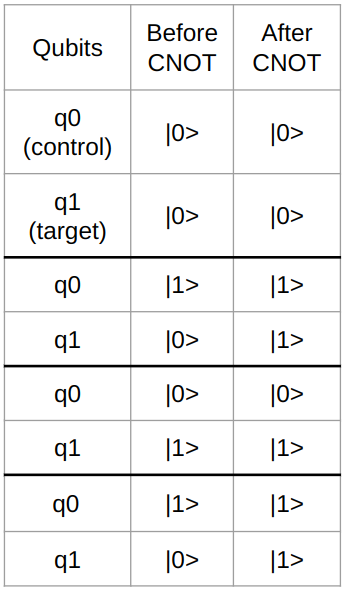

Quantum XOR is made with two CNOTs. Here, q₀ and q₁ are control qubits, and q₂ is the function’s target qubit:

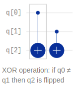

Below is the example of how XOR works. If both control qubits q₀ and q₁ are in the same state (|0> or |1>), the target qubit q₁ does not change its value (images 1 and 4). If q₀ is in different state than q₁, then the target qubit changes its value (images images 2 and 3).

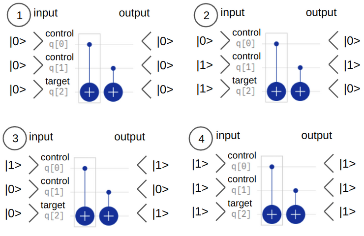

Each constraint from above has a corresponding clause qubit, each controlled by an XOR function. After XORs, we add a multiple controlled NOT gate. It is similar to the CNOT, but has several control qubits. To flip the output qubit, all control qubits must be in the ∣1 > state. To prepare qubits for further iterations, we have to reinitialize them using an _uncomputing_ technique. It consists in re-applying XOR functions, as this quantum operation is reversible.

Sudoku oracle: qubit register v corresponds to four cell values, qubit register c corresponds to clauses, the out qubit is flipped by a NOT-gate controlled by the four clause qubits. The XORs are repeated after the CCCCNOT. After that, we repeat the same XORs to uncompute clause register.

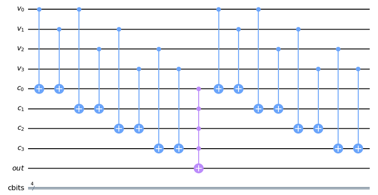

Below is an example of how the oracle works on an incorrect solution 0010. We can see that the output qubit does not change its value, and it helps the algorithm to understand that the proposed solution is incorrect.

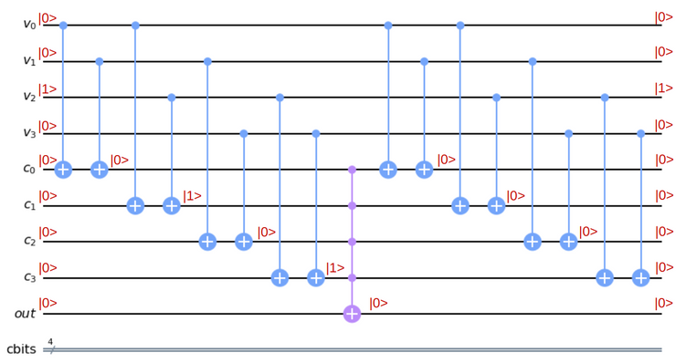

The image below is an exemple of a correct solution. We see that the output qubit flips and marks the solution as a correct one.

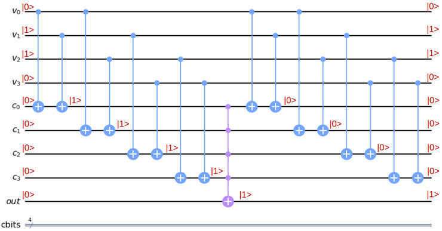

### Tools we can already use

There are more and more quantum computing frameworks in open use. There are ones made by IBM, Google, Microsoft, D-Wave, and others. This article focuses on the IBM’s QisKit. QisKit proposes a complete learning environment, allowing a better understanding of quantum computing. It consists of several tools, one of which is a python library. It allows composing and running algorithms either on a quantum computer, or on a simulator.

### Implementation in QisKit

The first part of the Grover’s algorithm we implement is the State Preparation. It initializes qubits into correct initial states. In total, we will need 9 qubits in our circuit: 4 value qubits for 4 values in the Sudoku that we seek to calculate (register `υ`), 4 clause qubits for each restriction (register `c`), and 1 output qubit used in calculations (register out). Besides, we define a classical register of 4 bits (`cbits`). Here we will save results of measurements of the υ register. Then we create a QuantumCircuit object and initialize it with all registers mentioned above.

```python
var_qubits = QuantumRegister(4, name='v')
clause_qubits = QuantumRegister(4, name='c')
output_qubit = QuantumRegister(1, name='out')
cbits = ClassicalRegister(4, name='cbits')
qc = QuantumCircuit(var_qubits, clause_qubits, output_qubit, cbits)
```

Next, we have to prepare qubits in desired initial states. We apply Hadamard gates to the value register. This operation produces a uniform distribution of amplitude through all possible states. In our case we will have 16 states: `1\4(|0000> + |0001> + |0010> + ... + |1111>)` when there are no known values.

```python
# Known qubits
# Case 1: no knwon values => 2 possible solutions: 0110 and 1001
known_qubits = {}
# Case 2: v₃ = 1 => only one solution 0110
known_qubits = {3: True}

# List of quibits which values are being calculated
unknown_qubits = [x for x in range(value_qubits) if x not in known_qubits]

# Initialize 'out0' in state |->
qc.initialize([1, -1]/np.sqrt(2), output_qubit)

# Initialize qubits in state |s>
for index, var_qubit in enumerate(var_qubits):
    if index in known_qubits:
        # qubits are in |0> state by dafault
        # if known_qubits[index] = 1, we switch qubit to |1>
        # using a not gate (qc.x)
        if known_qubits[index]:
            qc.x(index)
    if index in unknown_qubits:
        # qubit initialized in the |+> state with an Hadamard gate (qc.h)
        qc.h(var_qubit)
```

The **Oracle** function consists of four XOR operations, one for each clause rule. `clause_list` contains all clause rules as tuples of two numbers. These numbers correspond to positions of qubits that must have different values in the υ register. In other words, a tuple (1, 3) in the clause list is translated as `v₁ ≠ v₃`.

Then we define the XOR operation that takes four arguments: quantum circuit, two input and one output qubits.

```python
def XOR(qc, a, b, output):
    qc.cx(a, output)
    qc.cx(b, output)
```


XOR operation: if q₀ ≠ q₁ then q₂ is flipped

We initialize the clause list with values: `v₀≠v₁`, `v₀≠v₂`, `v₁≠v₃` as `v₂≠v₃`, as upper-left value (`v₀`) must be different from the upper-right and lower-left (`v₁` and `v₂`), upper-right (`v₁`) must be different from lower-right (`v₃`), and lower-left (`v₂`) must differ from lower-right (`v₃`).

Then we define the oracle function, passing the quantum circuit, clause list and clause qubits as arguments. In this function, for each clause we add a XOR operation to our circuit. The XORs take value qubits as input and clause qubits and as outputs. Then we apply a multi-control NOT (`qc.mct`). This operation flips the output qubit when all clause qubits are in the ∣1 > state. Then, to prepare qubits for further iterations, we have to reinitialize their values to the original states. The easiest way to do so is to perform an _uncompute_ operation. It consists in applying all gates except the `qc.mct` once more to cancel out all modifications of the clause and value registers.

```python
 clause_list = [
	(0, 1), (0, 2), (1, 3), (2, 3)
]

def sudoku_oracle(qc, clause_list, clause_qubits):
    # Compute clauses
    i = 0
    for clause in clause_list:
        XOR(qc, clause[0], clause[1], clause_qubits[i])
        i += 1

    # Flip 'output' bit if all clauses are satisfied
    qc.mct(clause_qubits, output_qubit)

    # Uncompute clauses to reset clause-checking bits to 0
    i = 0
    for clause in clause_list:
        XOR(qc, clause[0], clause[1], clause_qubits[i])
	        i += 1
```

The next component of the algorithm is the **Amplitude Amplification** operation, or the **diffuser**. Its role is to detect the state which amplitude has a phase different from others, and to increase its module. It increases chances of measuring the correct solution.

Diffuser’s implementation consists of a row of Hadamard gates, a row of NOT gates, a multi-controlled Z gate, and a row of NOT and Hadamard gates. If some values are known beforehand, for example, `v₂=1`, then we are not going to include the `v₂` qubit to the diffuser.

Diffuser when there are no known qubit values:

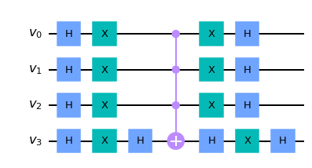

Diffuser for the case when v₂ is known:

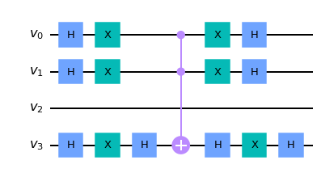

```python
def diffuser(value_qubits_number, unknown_qubits):
    qc = QuantumCircuit(value_qubits_number)
    # Apply transformation |s> -> |00..0> (H-gates)
    for qubit in unknown_qubits:
        qc.h(qubit)

    # Apply transformation |00..0> -> |11..1> (X-gates)
    for qubit in unknown_qubits:
        qc.x(qubit)

    # Do multi-controlled-Z gate
    qc.h(value_qubits_number - 1)
    qc.mct(unknown_qubits[:-1], value_qubits_number - 1)  # multi-controlled-toffoli
    qc.h(value_qubits_number - 1)

    # Apply transformation |11..1> -> |00..0>
    for qubit in unknown_qubits:
        qc.x(qubit)

    # Apply transformation |00..0> -> |s>
    for qubit in unknown_qubits:
        qc.h(qubit)

    # We will return the diffuser as a gate
    U_s = qc.to_gate()
    U_s.name = "U$_s$"
    return U_s
```

Once we have all bricks implemented, we can build the body of the algorithm. We will consider two different scenarios. First, all four cells are empty, and there are two correct solutions possible: 0110 and 1001. In the second scenario, one value is known: `v₁ = 0`, and there is a single correct solution.

```python
## First Iteration
# Apply our oracle
sudoku_oracle(qc, clause_list, clause_qubits)
qc.barrier()  # for visual separation
# Apply our diffuser
qc.append(diffuser(value_qubits, unknown_qubits), [0,1,2,3])

## Second Iteration
sudoku_oracle(qc, clause_list, clause_qubits)
qc.barrier()  # for visual separation
# Apply our diffuser
qc.append(diffuser(value_qubits, unknown_qubits), [0,1,2,3])

# Measure the variable qubits
qc.measure(var_qubits, cbits)

qc.draw(fold=-1)
```

Below is the result of the `qc.draw()`, the full circuit we use in computations. Note that the `v₂` qubit is initiated to the `|1>` state to illustrate how to implement the case when we know beforehand that `v₂=1`.

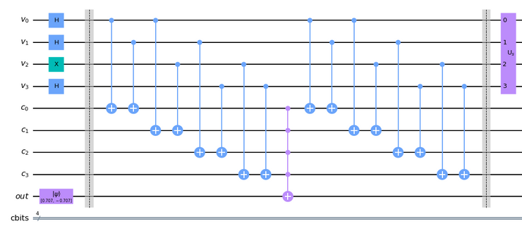

First half of the algorithm: before the first barrier - data initialization, then the first oracle application, and a diffuser (amplitude amplification)

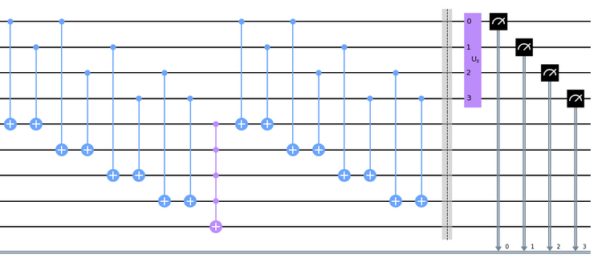

Second half of the algorithm: the second oracle application, the second diffuser, and the measurement of the value qubits to the classical register

After combining all operations on the quantum circuit, we initiate a backend. We can use a quantum computer or a simulator as a backend. Then we transpile the quantum circuit to a form understandable by the simulator. We assemble it, perform calculations and plots results on a histogram. By default, each run of the algorithm runs 1024 calculations in order to collect statistics on solutions.

```python
# Simulate and plot results
aer_simulator = Aer.get_backend('aer_simulator')
transpiled_qc = transpile(qc, aer_simulator)
qobj = assemble(transpiled_qc)
result = aer_simulator.run(qobj).result()
plot_histogram(result.get_counts())
```

**The whole code:**

```python
from ibm_quantum_widgets import CircuitComposer
import numpy as np
from numpy import pi
from qiskit import Aer, ClassicalRegister, QuantumCircuit, QuantumRegister, assemble, transpile
from qiskit.visualization import plot_histogram

def sudoku_oracle(qc, clause_list, clause_qubits):
    # Compute clauses
    i = 0
    for clause in clause_list:
        XOR(qc, clause[0], clause[1], clause_qubits[i])
        i += 1

    # Flip 'output' bit if all clauses are satisfied
    qc.mct(clause_qubits, output_qubit)

    # Uncompute clauses to reset clause-checking bits to 0
    i = 0
    for clause in clause_list:
        XOR(qc, clause[0], clause[1], clause_qubits[i])
        i += 1

clause_list = [[0,1],
               [0,2],
               [1,3],
               [2,3]]

def XOR(qc, a, b, output):
    qc.cx(a, output)
    qc.cx(b, output)

def diffuser(value_qubits, qubits):
    qc = QuantumCircuit(value_qubits)
    # Apply transformation |s> -> |00..0> (H-gates)
    for qubit in qubits:
        qc.h(qubit)
    # Apply transformation |00..0> -> |11..1> (X-gates)
    for qubit in qubits:
        qc.x(qubit)
    # Do multi-controlled-Z gate
    qc.h(value_qubits - 1)
    qc.mct(qubits[:-1], value_qubits - 1)  # multi-controlled-toffoli
    qc.h(value_qubits - 1)
    # Apply transformation |11..1> -> |00..0>
    for qubit in qubits:
        qc.x(qubit)
    # Apply transformation |00..0> -> |s>
    for qubit in qubits:
        qc.h(qubit)
    # We will return the diffuser as a gate
    U_s = qc.to_gate()
    U_s.name = "U$_s$"
    return U_s

value_qubits = 4
clause_number = len(clause_list)
var_qubits = QuantumRegister(value_qubits, name='v')
clause_qubits = QuantumRegister(clause_number, name='c')
output_qubit = QuantumRegister(1, name='out')
cbits = ClassicalRegister(value_qubits, name='cbits')
qc = QuantumCircuit(var_qubits, clause_qubits, output_qubit, cbits)

# Known qubits
# Case 1: no knwon values
known_qubits = {}
# Case 2: v₂ = 1
known_qubits = {2: True}

# List of quibits whose values we are calculating
unknown_qubits = [x for x in range(value_qubits) if x not in known_qubits]

# Initialize 'out0' in state |->
qc.initialize([1, -1]/np.sqrt(2), output_qubit)

# Initialize qubits in state |s>
for index, var_qubit in enumerate(var_qubits):
    if index in known_qubits:
        if known_qubits[index]:
            qc.x(index)
    if index in unknown_qubits:
        qc.h(var_qubit)

qc.barrier()  # for visual separation

## First Iteration
# Apply our oracle
sudoku_oracle(qc, clause_list, clause_qubits)
qc.barrier()  # for visual separation
# Apply our diffuser
qc.append(diffuser(value_qubits, unknown_qubits), [0,1,2,3])

## Second Iteration
sudoku_oracle(qc, clause_list, clause_qubits)
qc.barrier()  # for visual separation
# Apply our diffuser
qc.append(diffuser(value_qubits, unknown_qubits), [0,1,2,3])

# Measure the variable qubits
qc.measure(var_qubits, cbits)

# Simulate and plot results
aer_simulator = Aer.get_backend('aer_simulator')
transpiled_qc = transpile(qc, aer_simulator)
qobj = assemble(transpiled_qc)
result = aer_simulator.run(qobj).result()
plot_histogram(result.get_counts())
```

### Running on simulator

Quantum computers proposed by IBM for free have only five qubits. It is not enough to implement our algorithm (we need nine). However, we are able to use a simulator that is able to emulate hundreds of qubits.

```python
# Simulate and plot results
aer_simulator = Aer.get_backend('aer_simulator')
transpiled_qc = transpile(qc, aer_simulator)
qobj = assemble(transpiled_qc)
result = aer_simulator.run(qobj).result()
plot_histogram(result.get_counts())
```

Picture below shows histogram of probabilities of each state after the calculations. Here probability of a state 𝒊 is equal to the number of times that the state 𝒊 was measured as a result of calculations `Nᵢ` divided by the total number of calculations `N`: `pᵢ = Nᵢ/N`. For the case N of a Sudoku with no known values, the histogram shows two equally possible solutions: 0110 or 1001. Note that every other state has a small chance of being measured.

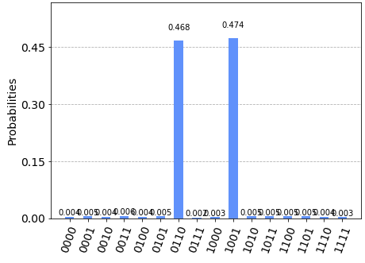

Simulation results when all four values are unknown: there are two equally probable solution: 0110 and 1001

The second histogram shows the probabilities for the case with one known value `v₁ = 0`. In this case the total number of possible states is divided by two. The correct solution is only one: 1001 as expected.

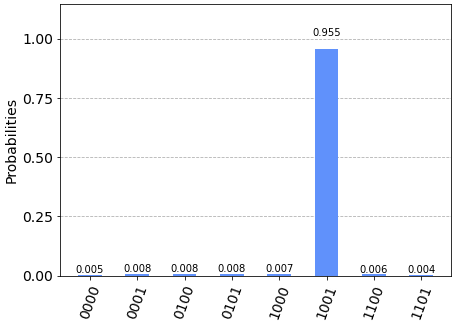

Simulation results when v1 is initialized to 0, and the diffuser is applied only to the unknown values: the most probable solution is 1001

## To learn more

Great book introducing quantum technologies, suits for all levels of understanding, friendly for all kinds of profiles: [https://www.oezratty.net/wordpress/2021/understanding-quantum-technologies-2021/](https://www.oezratty.net/wordpress/2021/understanding-quantum-technologies-2021/)

QisKit: [https://qiskit.org/](https://qiskit.org/)

QisKit Textbook: [https://qiskit.org/textbook/preface.html](https://qiskit.org/textbook/preface.html)
